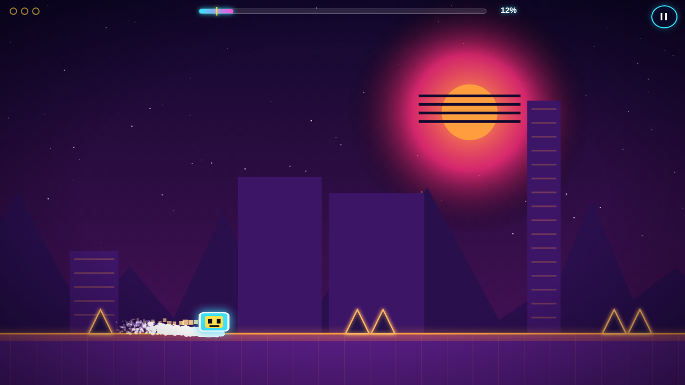

# PULSE DASH ⚡

A neon, music-synced tribute to **Geometry Dash** — built with vanilla JavaScript,
HTML5 canvas and WebAudio. No dependencies, no build step, no asset files:
the soundtrack is synthesized live and every visual is drawn in code.



## Play

Open `index.html` in a browser, or serve the folder:

```bash
python3 -m http.server 8080
# → http://localhost:8080
```

## Controls

| Input | Action |
| --- | --- |
| `SPACE` / `↑` / `W` / click / tap | Jump (hold to keep hopping) · thrust in ship mode |
| `ESC` / `P` | Pause |
| `R` | Restart attempt |
| `M` | Mute |
| `Z` / `X` | Place / remove checkpoint (practice mode) |

## What's in the box

- **3 handcrafted levels** with ramping difficulty — *Stereo Sunrise* (easy),
  *Neon Overdrive* (normal) and *Hyper Voltage* (hard, fast speed).
- **Cube & ship modes**, gravity portals, speed portals, jump pads, yellow
  orbs, saw blades, one-way platforms.
- **Procedural synthwave soundtrack** per level (kick, bass, arps, pads —
  all WebAudio oscillators) with beat-synced visuals: the floor line, block
  glow and sun halo all pulse on the kick.
- **Practice mode** with automatic + manual checkpoints when a section has
  you stuck.
- **3 secret coins per level**, saved on completion, shown on level cards.
- **Juice**: particle trails, landing dust, death explosions, screen shake,
  portal flashes, squash & stretch, confetti at the finish gate.
- **Persistence**: best %, coins and attempt counts in `localStorage`.
- An **autoplaying attract demo** runs behind the title screen.

## Code map

| File | Purpose |
| --- | --- |
| `js/config.js` | Physics tuning, themes, helpers |
| `js/audio.js` | Procedural music scheduler + SFX |
| `js/effects.js` | Particles, rings, screen shake, floating text |
| `js/levels.js` | Level-builder DSL + the 3 levels |
| `js/game.js` | Engine: physics, collisions, states, rendering, UI |

Physics runs on a fixed 240 Hz substep under a `requestAnimationFrame`
render loop, so collisions stay stable at any frame rate. Levels are
authored in block units via a small builder DSL — see the feasibility
cheat-sheet at the top of `js/levels.js` if you want to design your own.
